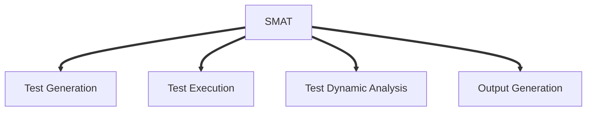
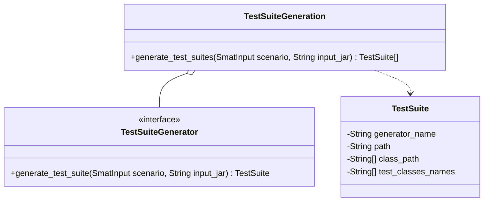
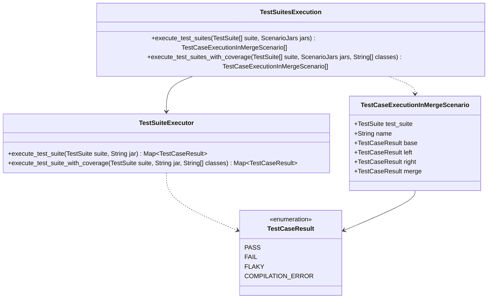
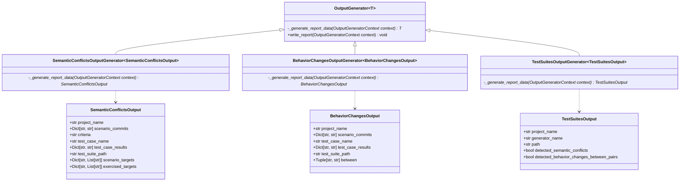
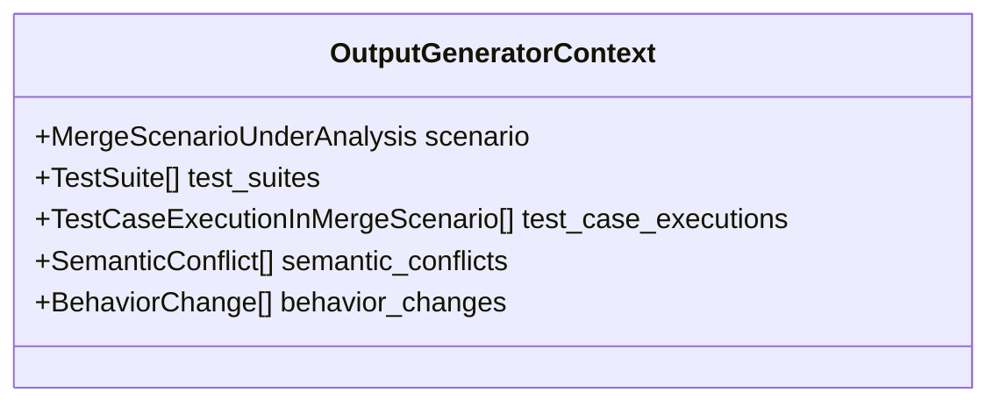

# Architecture

This documentation dive into details of SMAT architecture.

## Overview

Currently, this is an overview of SMAT architecture.

## Test Suite Generation
This module is responsible for generating tests suites for a given JAR. It's public API is provided by the class `TestSuiteGeneration` which exposes a single method, capable of generating test suites using the Test Suite Generators implemented in SMAT.
### Class Diagram
Following, there's the Class Diagram for this module.

### Trade-offs
- The `TestSuiteGeneration` class has a dependency with the [`SmatInput`](nimrod/input_parsing/smat_input) class which provides further context information that is required by some generators (e.g.: Evosuite Differential needs to have access to the `base` JAR in order to perform the diff).

### Future improvements
- Evaluate the usage of concurrency in `TestSuiteGeneration` to allow faster generation of test suites.

## Test Suites Execution
This module is responsible for executin tests suites for a given merge scenario. Its public API is provided by the class `TestSuitesExecution` which exposes a method, capable of executing test suites in the versions provided.

## Dynamic Analysis

## Output Generation
This module is responsible for generating the reports with the results of SMAT. Each report has its own file, containing relevant information to its context.

### Trade-offs
- Since there is many information which can be needed to build all the reports available, in order to preserve all generators with the same interface, the data has been encapsulated in a Context object, which is passed into each generator.

- In order to generate Semantic Conflicts reports, it was required to re-execute some of the test cases using coverage collection. Thus, in  `SemanticConflictOutputGenerator` there's a dependency with the `TestSuitesExecution` module. This coupling has been discussed to be acceptable within the project.
