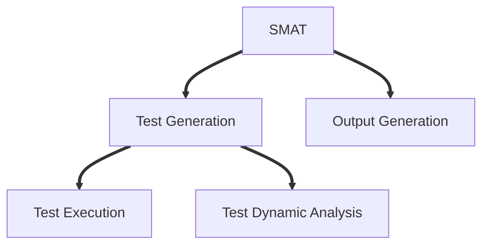
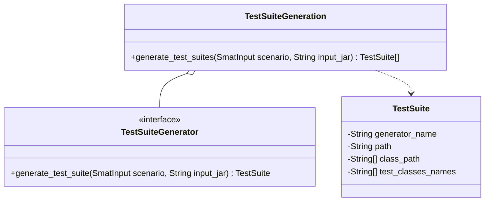

# Architecture

This documentation dive into details of SMAT architecture.

## Overview

Currently, this is an overview of SMAT architecture.

## Test Suite Generation
This module is responsible for generating tests suites for a given JAR. It's public API is provided by the class `TestSuiteGeneration` which exposes a single method, capable of generating test suites using the Test Suite Generators implemented in SMAT.
### Class Diagram
Following, there's the Class Diagram for this module.

### Trade-offs
- The `TestSuiteGeneration` class has a dependency with the [`SmatInput`](nimrod/input_parsing/smat_input) class which provides further context information that is required by some generators (e.g.: Evosuite Differential needs to have access to the `base` JAR in order to perform the diff).

### Future improvements
- Evaluate the usage of concurrency in `TestSuiteGeneration` to allow faster generation of test suites.