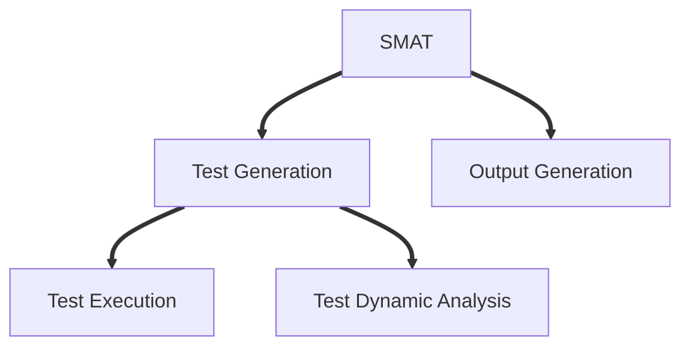

# Architecture overview

Currently, this is an overview of SMAT architecture.

```mermaid
graph TD
    A[SMAT] ==> B[Test Generation]
    B ==> C[Test Execution]
    B ==> D[Test Dynamic Analysis]
    A ==> E[Output Generation]
```